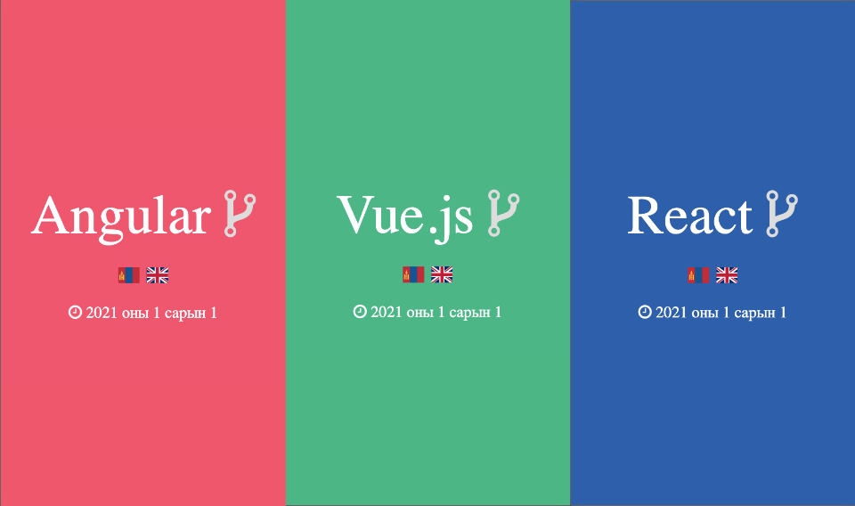

# Минималист хөгжүүлэгч байх нь - Angular/Vue.js/React

Минимализм амьдралын хэв маяг нь чухал үнэт зүйлсдээ анхаарах эрх чөлөөг олгон,
сэтгэлийн амар амгаланг болоод аз жаргалыг илүүтэй мэдрэх ач холбогдолтой. Энэ
амьдралын арга барилыг хэрэгжүүлэгч нь **минималист** юм. Аан тэгвэл минималист
хөжүүлэгч байж минимал шинжийг вэб хөгжүүлэх технологиудад хэрхэн нэвтрүүлж
болох талаар таны хувьд ямар байр сууртай байна вэ? Та өмнө бодож үзэж байв уу?

Өнгөрсөн зун Netflix дээрх Tidying Up with Marie Kondo цувралын эхний ангийг
үзсэний дараагаар програм хангамжийн технологиудад минимализм ойлголтыг ашиглаж
илүү нягт нямбай, цэгцтэй кодчилох талаар энэхүү нийтлэлийг бичих санаа төрсөн
юм. Орчин цагийн тренд болж буй №1 **Angular**, №2 **Vue.js**, №3 **React** мундаг
технологиуд дээр вэб аппликейшн хөгжүүлэлтийг минимал хэлбэрт оруулах өөрийн
ойлголт, санаа бодлоо хуваалцая. Энгийн бөгөөд баримтлах минимал бүтцийн үндсэн
зарчмууд бол:

- Үнэхээр шаардлагагүй бол кодондоо тайлбар бичиж үлдээхгүй байх
- Онцын хэрэггүй dependency сангуудыг татаж package.json файлд төвлөрүүлэхүй байх
- Сангуудыг CDN байдлаар аппликейшндаа оруулж ашиглахгүй байх ба илүү биеэ даах
боломжоор хангаж өгөх
- Олон дахин ашиглагдах боломжтой функц, компонент, темплейтүүдийг бий болгож
ашиглах, яг л лего тоглоомын ижил хэв загвартай блокууд шиг
- Аппликейшнд ерөөс ашиглагдахгүй байгаа зүйлсээ олж чөлөөлөх

[цааш унших](https://javkhlantugs-nyamdorj.medium.com/%D0%BC%D0%B8%D0%BD%D0%B8%D0%BC%D0%B0%D0%BB%D0%B8%D1%81%D1%82-%D1%85%D3%A9%D0%B3%D0%B6%D2%AF%D2%AF%D0%BB%D1%8D%D0%B3%D1%87-%D0%B1%D0%B0%D0%B9%D1%85-%D0%BD%D1%8C-angular-vue-js-react-2311eb0e661c)